# ニックネーム
> 今中国の大手IT企業でニックネーム付けなければならないです。
{: .prompt-tip }

> ### 会社の理由
- 上下階層に薄くなって気軽い職場を作られる目的です。
- 別の部門の同僚と連携しようとしている時にスムーズに仕事を進められるようになる為。ニックネームだけ相手の身分が全然わからないんです。

> ### 同僚の間の呼び方
- 同僚の間にお互いにニックネーム付けてくれます。例えば、同僚の名字は「周」である人のお宅の経済状況を合わせて「周老板」になります。金持ちような感じだけでなく同僚を羨ましくてからかう感情も含めている言葉ですから。でも、この呼び方は仲良い同僚でないと怒られるようになりかねないです。
- 私は余さんのことを「余少」と呼び方しています。「少」は「少年」と「少爷」という意味を含めています。若い人と金銭や財産を豊かに持っている一族の息子である即ちお坊っちゃんです。
- 私の(烟友/搭子一緒にサボる仲間)タバコ仲間である美人の同僚ですが、「楠哥」(楠兄ちゃん)ってニックネーム付けました。

### 小さい物語
第一目の会社での話です。夜七時ぐらい時、仕事が終わって友たちと楽園のハロウィンイベントに参加する予定でした。友達が私の気になる女の子を誘ってくれました。私がとても楽しんでいました。出発するところを、開発中のゲームに障害が出てきました。今これを対応してくれるかって社長から相談ですが、私が明日やりますって返事しました。でも社長がしつこく問い詰めてうるさくてしょうがないです。あなたのためじゃない、自分の責任感だからね、腹減った、焼き物が食べたいって机を叩きながら言います。結局残業を受けて好きな女の子と一緒に遊びそびれてしまいましたけど。一万五千円する社長のおごりもらいました。

## 一日流れ
### 出入口
{: data-toc-skip='' .mt-4}
{: width="250" height="125" .w-50 .left}
- 出勤の時間が決まってないです。自由だと言えないけど、午前12時前に出勤すれば大丈夫です。
# &nbsp;
# &nbsp;
# &nbsp;
# &nbsp;

### 私のカードです。
{: data-toc-skip='' .mt-4}
{: width="150" height="75" .w-50 .right}
> このカードを出入口のタッチすると会社に入れられます。私は10時ぐらい会社に着いました。そして、お茶を入れたりネットでニュースを読んだりしていました。多分11時になると同僚がそろってきます。皆一緒に雑談して昼ご飯が何を食べようって話します。

### スケジュール

```mermaid
 gantt
  dateFormat HH:mm
  axisFormat %H:%M
  todayMarker off
  title 働き時間
  出勤 : milestone, m1, 10:00, 1m
  お茶新聞 : b, 10:00, 1h
  計画立ち :after b c, 11:00, 1h
  昼ご飯休憩 :after c d, 12:00, 2h
  仕事 :after d e, 14:00, 5h
  晩ご飯 :after e f, 19:00, 1h
  ミーティング :after f g, 20:00, 2h
  退勤 : milestone, m2, 22:00, 1m
```

> 一日八時間を超えればいいだけど。
{: .prompt-info }

### 昼ご飯
会社の当たりレストランで食べたり、一緒に出前に頼んだりしていました。昼ご飯は一日中とても重要なところです。同僚たちと一緒に上司のツッコミの時間ですから。

### 働く環境



## 写真
#### 会議室

#### フィギュア

#### ペット

#### 壁の飾り

#### 同僚のクラクション

